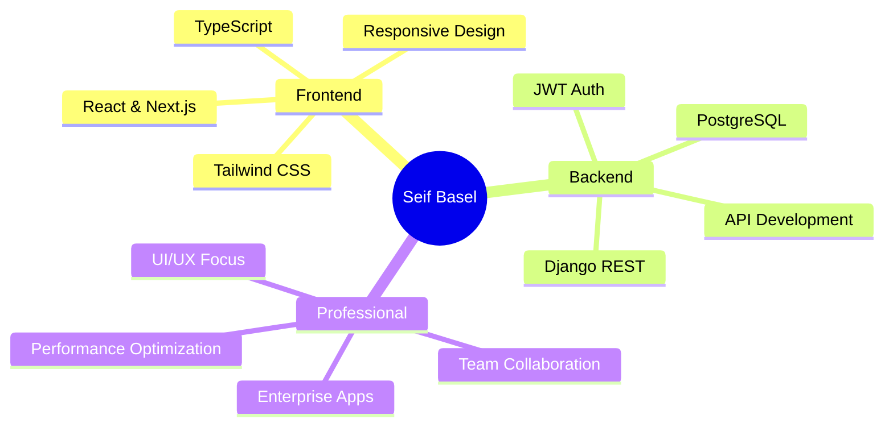

<h1 align="center">
  
</h1>

<h3 align="center">
  
</h3>

<p align="center">
  
</p>

---

## 🚀 About Me

```typescript
const seif = {
    role: "Full Stack Developer",
    location: "Cairo, Egypt 🇪🇬",
    experience: {
        company: "Transfective (Dubai)",
        position: "Frontend Developer",
        achievement: "50% reduction in delivery time"
    },
    education: "Computer Science @ Damietta University",
    currentFocus: ["Next.js", "Django REST", "Scalable Architectures"],
    openTo: ["Collaboration", "Freelance Projects", "Full-time Opportunities"]
};
```


## 💻 Tech Stack

<div align="center">

### Frontend Magic ✨
<p>
  
</p>

### Backend Power ⚡
<p>
  
</p>

### Tools & Workflow 🛠️
<p>
  
</p>

</div>


## 🏆 Featured Work

<table>
<tr>
<td width="50%">

### 🌐 TransHub
**Enterprise Localization Platform**
- Built with React, Next.js, Tailwind CSS
- 50% faster delivery times
- Used by Transfective Dubai

</td>
<td width="50%">

### 🛒 PROVA 3D
**AR E-Commerce Platform**
- Virtual try-on with AR
- Sentiment analysis (ML)
- Django REST + React

</td>
</tr>

<tr>
<td width="50%">

### 🪙 Coinat
**Premium Coins Marketplace**
- Advanced search & filtering
- Smooth GSAP animations
- Next.js + Framer Motion

</td>
<td width="50%">

### 👔 Transfective HR
**Internal HR System**
- Employee management
- Leave & interview tracking
- Next.js enterprise app

</td>
</tr>
</table>


## 📊 GitHub Stats

<div align="center">
  
  
</div>

<div align="center">
  
</div>


## 🌟 Core Competencies

<div align="center">



</div>


## 📫 Let's Connect

<div align="center">

[](https://www.linkedin.com/in/seif-basel-1a09191b9)
[](mailto:seifbasel950@gmail.com)
[](https://github.com/seifbasel)
[](https://github.com/seifbasel)

</div>

<div align="center">
  
</div>

<div align="center">
  
### 💡 Open to opportunities • Available for collaboration • Let's build something amazing! ✨

</div>
